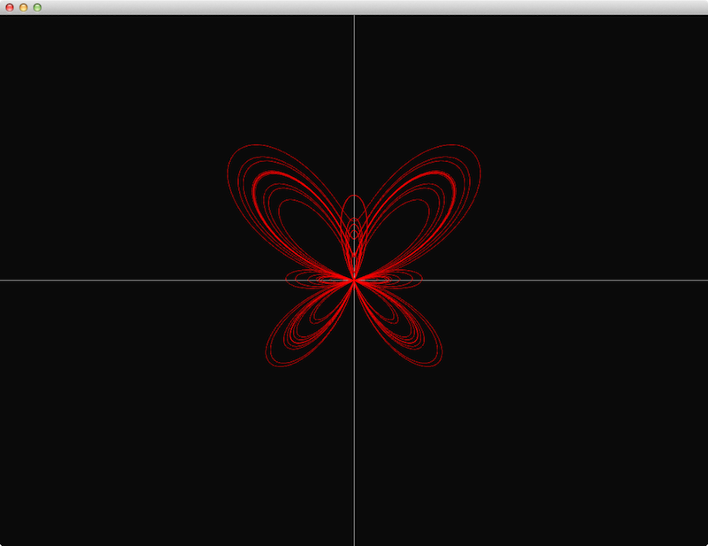
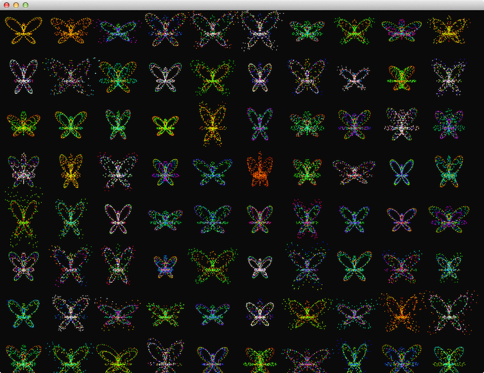
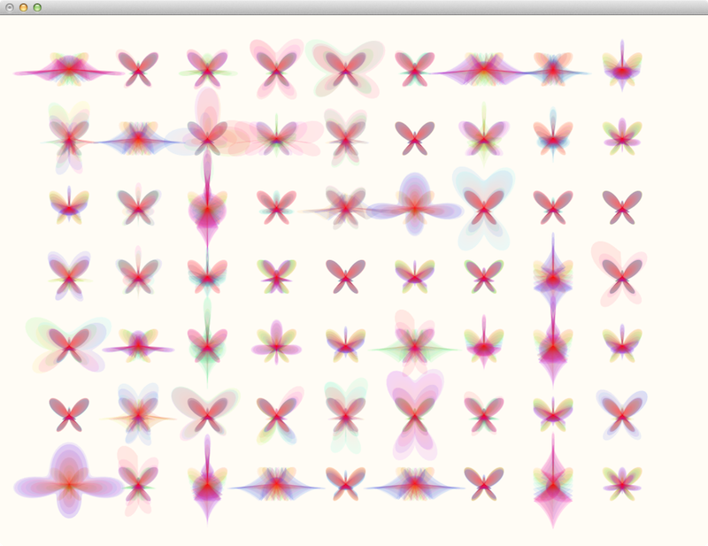

# butterFlyCurve openFrameworks
- Das Fomular kommt von <http://paulbourke.net/geometry/butterfly/>

*** 

- butterFlyCurve
	- 

*** 

- butterFly_generator (butterFly line or point Generator)
	- 

*** 

- butterFly mesh
	- 